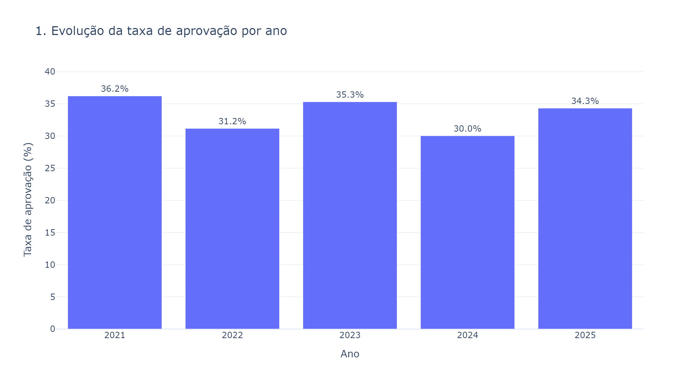
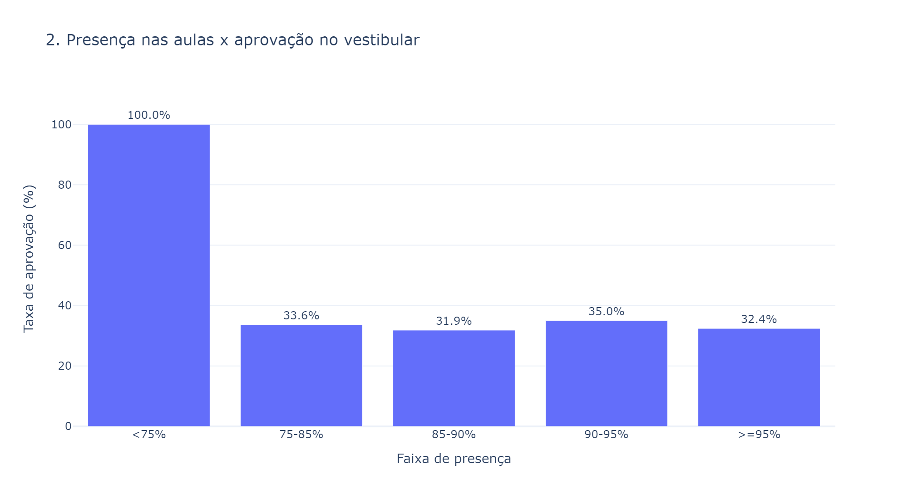
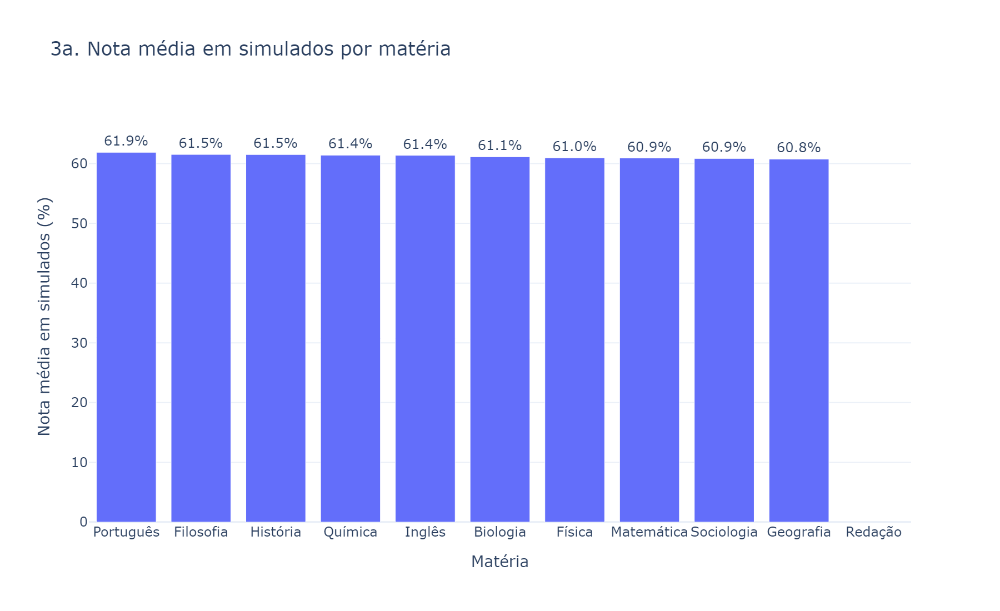
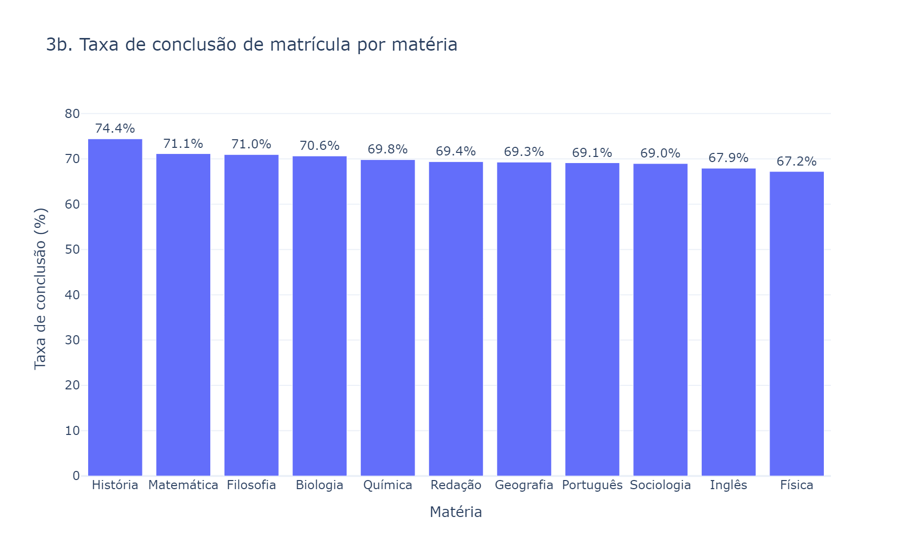
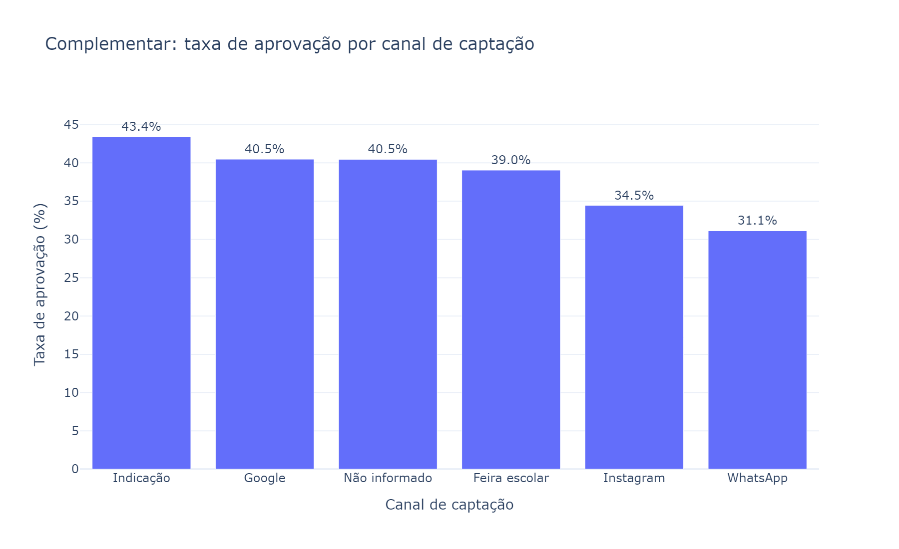
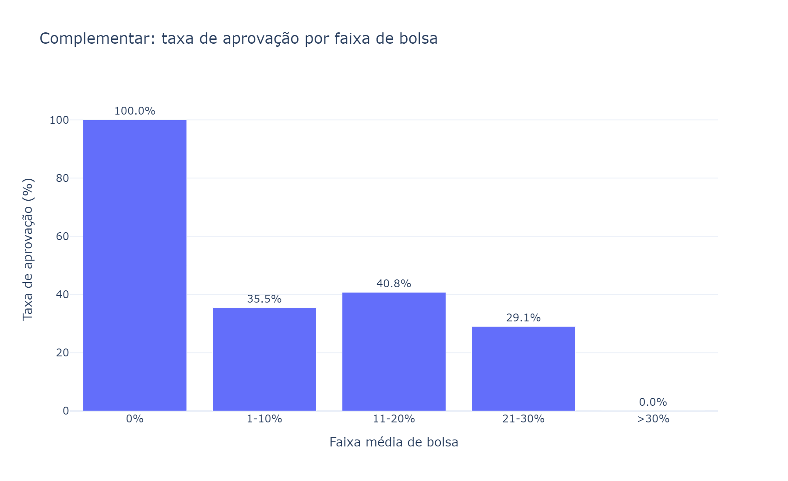

# AprovaEdu Analytics — Desafio Técnico (Analista de Dados)

Solução do case técnico da Logap: processamento e análise da base de dados de uma rede de cursinhos pré-vestibulares (2021–2025), com o objetivo de entender desempenho dos alunos, efetividade dos cursos e fatores associados à aprovação no vestibular.

## Estrutura do projeto

```
aprovaedu-analytics/
├── data/
│   ├── raw/            # 9 CSVs originais fornecidos (não alterados)
│   └── processed/      # dados tratados (CSVs) + aprovaedu.db (SQLite) + scores do modelo
├── src/
│   ├── etl.py                       # pipeline de tratamento (reutilizável, chamado pelo notebook 01)
│   ├── analysis.py                  # gera os números/gráficos usados no relatório
│   ├── modelo_preditivo.py          # diferencial: modelo de score de aprovação
│   ├── export_dashboard_charts.py   # exporta os gráficos do dashboard como PNG (para o README)
│   └── build_notebooks.py           # gera os 3 notebooks a partir das células definidas aqui
├── notebooks/
│   ├── 01_etl_tratamento.ipynb   # diagnóstico dos dados brutos + decisões de tratamento, célula a célula
│   ├── 02_analise.ipynb          # respostas às 4 perguntas obrigatórias, com gráficos
│   └── 03_modelo_preditivo.ipynb # diferencial: modelo de score de aprovação
├── dashboard/
│   └── app.py            # dashboard interativo (Streamlit)
├── docs/
│   └── dicionario_dados.md       # descrição de cada tabela/coluna
├── report/
│   ├── relatorio_final.md        # relatório com as respostas e recomendações
│   ├── figures/                  # gráficos do relatório, exportados em PNG
│   └── dashboard_screenshots/    # gráficos do dashboard, exportados em PNG
└── requirements.txt      # versões fixadas (testado em Python 3.8.0)
```

## Como rodar

Requer Python 3.8+. Nos comandos abaixo, use `python` (Linux/Mac) ou `py` (Windows, se `python` não estiver no PATH) — ambos funcionam, testado com o launcher `py` do Windows.

```bash
pip install -r requirements.txt

# 1. Rodar o tratamento de dados (gera data/processed/*.csv e aprovaedu.db)
python src/etl.py

# 2. (opcional) Gerar os números/gráficos usados no relatório
python src/analysis.py

# 3. (opcional) Treinar o modelo preditivo (diferencial)
python src/modelo_preditivo.py

# 4. Ver os notebooks com a análise célula a célula
python -m jupyter notebook notebooks/

# 5. Rodar o dashboard interativo
python -m streamlit run dashboard/app.py
```

Os notebooks em `notebooks/` já estão salvos com os outputs executados — podem ser lidos diretamente no GitHub sem precisar rodar nada.

## Ferramentas utilizadas

- **Python 3.8** + **pandas** para tratamento e análise dos dados
- **Jupyter Notebook** para documentar decisões e análises célula a célula
- **Matplotlib** para os gráficos do relatório final
- **SQLite** como estrutura analítica final consolidada (`data/processed/aprovaedu.db`)
- **Streamlit + Plotly** para o dashboard interativo
- **scikit-learn** para o modelo preditivo (diferencial)

## Decisões técnicas e analíticas (resumo)

O detalhamento completo está em [`notebooks/01_etl_tratamento.ipynb`](notebooks/01_etl_tratamento.ipynb). Resumo:

- **Padronização de categorias**: colunas como cidade, matéria, status de presença/matrícula/simulado, dispositivo e modalidade vinham com variações de maiúsculas/acentuação/abreviação (ex.: `"presente"` vs `"Presente"`, `"Mat."` vs `"Matemática"`) e foram normalizadas para um valor canônico único.
- **Datas em 4 formatos distintos** (`YYYY-MM-DD`, `YYYY/MM/DD`, `DD/MM/YYYY`, `MM-DD-YYYY`, com/sem hora) foram convertidas com um parser tolerante que desambigua pela posição do ano e pelo separador.
- **Notas de simulado fora da faixa 0–100** (ex.: `-3.5`, `1005`) foram anuladas e sinalizadas (`nota_valida=False`) em vez de removidas ou "corrigidas" por suposição.
- **Cadastro de professor duplicado** (`P_DUP_001`, sem nenhuma referência em outras tabelas) foi removido.
- **Valores ausentes em colunas categóricas** foram preenchidos com `"Não informado"` (ou `"Não registrado"` para presença, para não confundir ausência de registro com falta efetiva).
- Foram geradas duas tabelas agregadas (*marts*) para sustentar as análises: `mart_aluno_ano` (presença × aprovação por aluno-ano) e `mart_curso_materia` (nota média em simulados × conclusão de matrícula por matéria-ano).
- **Validação de integridade automática**: toda execução de `src/etl.py` roda uma checagem de chaves primárias, chaves estrangeiras órfãs, domínio das colunas categóricas e datas não reconhecidas — o pipeline falha alto e rápido (`AssertionError`) se algo quebrar essas premissas no futuro, em vez de gerar dados silenciosamente incorretos.

O significado de cada tabela/coluna está documentado em [`docs/dicionario_dados.md`](docs/dicionario_dados.md), incluindo uma limitação metodológica conhecida sobre a correspondência ano de matrícula × ano de aprovação.

## Diferenciais entregues

- **Dashboard interativo** ([`dashboard/app.py`](dashboard/app.py), Streamlit + Plotly)
- **Banco SQLite estruturado** (`data/processed/aprovaedu.db`)
- **Modelo preditivo** ([`notebooks/03_modelo_preditivo.ipynb`](notebooks/03_modelo_preditivo.ipynb)): testamos se dá para prever aprovação a partir dos dados operacionais disponíveis. Resultado honesto: **não dá** (AUC ≈ 0,49, equivalente a acaso) — achado reportado como conclusão de negócio, não escondido.
- **Dicionário de dados** completo ([`docs/dicionario_dados.md`](docs/dicionario_dados.md))

## Respostas às perguntas obrigatórias

Ver [`report/relatorio_final.md`](report/relatorio_final.md) para as respostas completas com gráficos, e [`notebooks/02_analise.ipynb`](notebooks/02_analise.ipynb) para o código reproduzível.

Resumo dos principais achados:

1. **Taxa de aprovação**: oscila entre 30% e 36% ao longo de 2021–2025, sem tendência clara de melhora.
2. **Presença x aprovação**: correlação praticamente nula (-0,01) nesta base — frequência isolada não é um bom preditor de aprovação.
3. **Desempenho por matéria**: diferenças pequenas entre matérias; Redação não tem nota estruturada em simulados na base (lacuna de dados).
4. **Modelo preditivo**: testado como diferencial; não teve poder preditivo (AUC≈0,49) — achado reportado com transparência.
5. **Recomendações**: ver seção 4 do relatório final.

## Demonstração

O dashboard interativo (Streamlit) reproduz as 4 análises com filtro por ano. Para rodar localmente:

```bash
python -m streamlit run dashboard/app.py
```

Prints das visualizações do dashboard (mesmos gráficos, exportados via `src/export_dashboard_charts.py`, sem precisar rodar o Streamlit):

| | |
|---|---|
|  |  |
|  |  |
|  |  |
