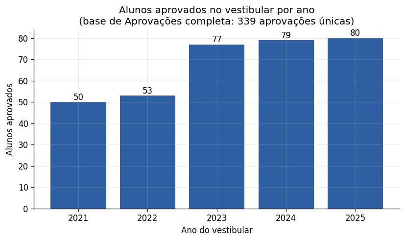
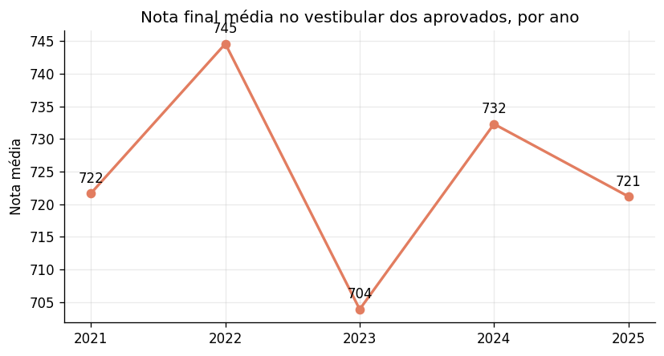
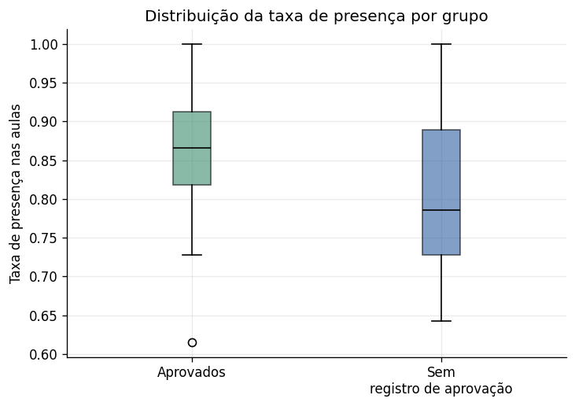
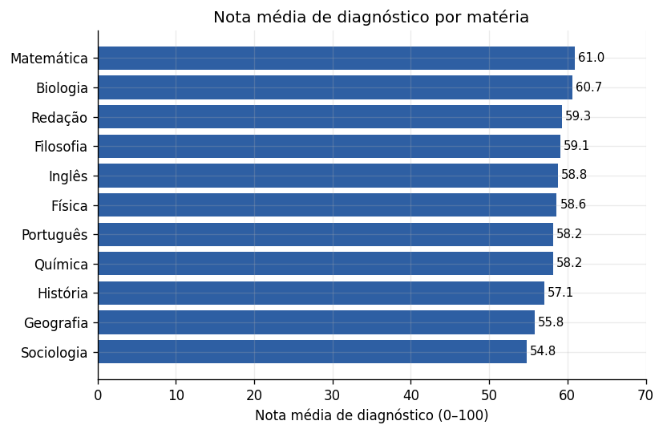
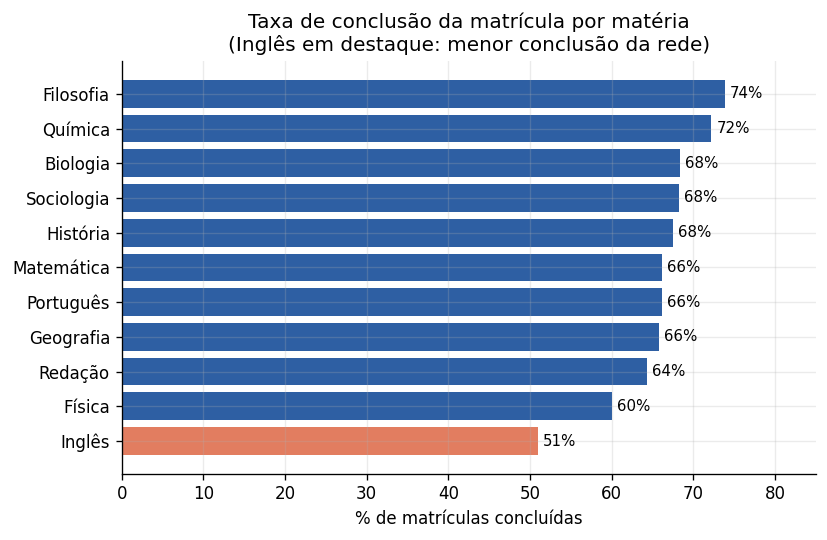

# Relatório Final — AprovaEdu Analytics

**Cliente:** rede de cursinhos pré-vestibulares (dados fictícios, 2021–2025)
**Reprodutibilidade:** todos os números deste relatório são calculados por
`src/analysis.py` e gravados em `outputs/resumo_indicadores.json` — nenhum
valor foi digitado à mão. Decisões de tratamento: `outputs/log_qualidade.md`.

> **Leia antes — confiança dos dados:** o arquivo fornecido contém amostras
> de até 500 linhas por tabela. Quatro tabelas são, na verdade, **completas**
> (Professores, Ofertas_Curso, Simulados e Aprovações — a amostra tem o mesmo
> tamanho do total informado no dicionário). As outras cinco (Estudantes,
> Matrículas, Resultados_Sim, Aulas, Presenças_Aulas) são **amostras parciais
> e independentes entre si**, o que reduz a sobreposição de alunos entre
> tabelas. Cada resposta abaixo indica em que base se apoia e com que grau
> de confiança.

---

## 1. Qual foi a evolução da taxa de aprovação ao longo dos anos?

**Base:** Aprovações (completa; 339 aprovações únicas após remover 15
lançamentos duplicados). **Confiança: alta** para números absolutos.

| Ano  | Alunos aprovados | Variação vs ano anterior |
|------|------------------:|-------------------------:|
| 2021 | 50 | — |
| 2022 | 53 | +6,0% |
| 2023 | 77 | **+45,3%** |
| 2024 | 79 | +2,6% |
| 2025 | 80 | +1,3% |

**Leitura dos movimentos:** o dado central é o **salto de +45% entre 2022 e
2023**, seguido de estabilização em um patamar ~50% acima do biênio inicial
(77–80 aprovados/ano). O padrão é típico de uma operação que mudou de escala
ou de metodologia em 2023 e depois amadureceu.

A **qualidade das aprovações se manteve**: a nota final média dos aprovados
no vestibular oscila entre 704 e 745 pontos ao longo dos 5 anos, sem
tendência de queda — ou seja, o cursinho não cresceu "baixando a régua".

**Sobre a "taxa" percentual:** uma taxa de aprovação verdadeira (aprovados ÷
matriculados do ano) exige o total de alunos matriculados por ano — mas só
temos 500 das 9.452 linhas de Matrículas, em amostra independente da base de
Aprovações. Dividir diretamente produziria números sem sentido (ex.: "555%"
em 2021). Decisão documentada: **reportar a evolução em números absolutos**,
que é o dado sólido, e deixar o cálculo percentual pronto no código para
quando a base completa de Matrículas estiver disponível.

---

## 2. Existe relação entre presença nas aulas e aprovação no vestibular?

**Base:** amostra de Presenças (500 registros → 47 alunos) cruzada com a base
completa de Aprovações. **Confiança: moderada/baixa** (n pequeno por
amostragem independente).

| Grupo | Presença média | Mediana | Desvio | n |
|---|---:|---:|---:|---:|
| Aprovados | **85,5%** | 86,6% | 10,3 p.p. | 18 |
| Sem registro de aprovação | **81,0%** | 78,6% | 10,2 p.p. | 29 |

**Teste de hipótese:** aplicamos Mann-Whitney U unilateral (não assume
normalidade; adequado a amostras pequenas): U = 331,5, **p = 0,062**. Ou
seja: a diferença de ~4,5 pontos percentuais a favor dos aprovados aponta na
direção esperada e fica *no limiar* da significância convencional (5%), mas
**não é conclusiva com este n**. É um sinal direcional coerente com a
literatura em educação, não uma prova.

Duas ressalvas honestas: (i) "não aparecer em Aprovações" não significa
necessariamente reprovação — o aluno pode só não estar nesta amostra; (ii)
presença e aprovação podem ter causas comuns (motivação, contexto do aluno),
então mesmo uma associação confirmada não seria automaticamente causal.

**Próximo passo objetivo:** reexecutar `src/analysis.py` sobre a base
completa de Presenças (74.997 registros). Com esse n, o mesmo teste terá
poder estatístico para uma resposta definitiva.

---

## 3. Quais cursos ou matérias parecem apresentar melhor desempenho?

Usamos três indicadores complementares.

### a) Nota média no diagnóstico de entrada (amostra de 500 matrículas)

Topo: **Matemática (61,0)**, **Biologia (60,7)**, **Redação (59,3)**. Base:
**Sociologia (54,8)** e **Geografia (55,8)**. Diferença de ~6 pontos entre
extremos — moderada, mas consistente.

### b) Taxa de conclusão da matrícula por matéria

O quadro muda: **Filosofia (73,8%)**, **Química (72,2%)** e **Biologia
(68,4%)** lideram; **Inglês (51,0%)** fica isoladamente abaixo de todas —
quase metade das matrículas de Inglês não é concluída, contra 60–74% nas
demais. Como a nota de diagnóstico de Inglês está na média (58,8), o problema
não parece ser o nível dos alunos, e sim algo específico da oferta (evasão,
horário, professor, material ou expectativa).

### c) Nota média nos simulados

| Matéria | Nota média | n |
|---|---:|---:|
| Matemática | 60,7 | 393 |
| Física | 59,6 | 107 |

A amostra de Resultados_Sim só cobriu simulados de Matemática e Física
(efeito da amostragem independente — não significa que as outras matérias
não tenham simulados). Comparação completa entre matérias fica para a base
integral.

**Achado adicional relevante:** cruzando os resultados com a dificuldade
declarada do simulado, a nota média em simulados "Fáceis" (60,2, n=235) é
praticamente igual à dos "Difíceis" (60,8, n=221). **O rótulo de dificuldade
não está discriminando nada** — ou a classificação é atribuída sem critério,
ou as provas não diferem de fato. É um problema de instrumento de avaliação
que merece atenção da coordenação.

**Síntese:** Matemática apresenta desempenho consistente nos dois indicadores
em que aparece; Biologia e Química vão bem em pelo menos duas métricas;
**Inglês é o ponto de atenção mais claro da rede**.

---

## 4. Quais recomendações você faria para a coordenação do cursinho?

1. **Investigar a evasão em Inglês (prioridade 1).** Menor taxa de conclusão
   por margem larga (51% vs 60–74%) com nota de entrada normal. Antes de
   qualquer ação, levantar hipóteses com dados internos: choque de horários,
   rotatividade de professor, material. É o sinal mais acionável da análise.

2. **Recalibrar a régua de dificuldade dos simulados.** Simulados "fáceis" e
   "difíceis" produzem a mesma nota média — o rótulo hoje não informa nada.
   Definir critério objetivo (ex.: % de acerto esperado por questão) para que
   a dificuldade declarada sirva de fato ao planejamento pedagógico.

3. **Piloto de monitoramento de presença.** O sinal presença→aprovação
   (+4,5 p.p., p=0,062) não é conclusivo, mas justifica um piloto de baixo
   custo: alerta à coordenação quando a presença do aluno cair abaixo de
   ~75–80%, com ação pedagógica durante o curso — em vez de só constatar o
   resultado do vestibular depois.

4. **Mapear o que mudou em 2023 e institucionalizar.** O salto de +45% nas
   aprovações entre 2022 e 2023, com estabilidade da nota média dos
   aprovados, sugere mudança estrutural bem-sucedida (metodologia, corpo
   docente, oferta). Identificar e documentar essas práticas para protegê-las
   de perda em trocas de equipe.

5. **Concentrar inteligência de captação no Instagram — e corrigir o
   cadastro.** Na amostra de estudantes, Instagram é o maior canal (151 de
   500, ~30%), mas esse número só apareceu depois de unificar as grafias
   `instagram`/`Instagram` — e 74 alunos (15%) estão sem canal informado.
   Recomendações: campo de captação com lista fixa no sistema (não texto
   livre) e obrigatório no cadastro.

6. **Fechar a lacuna de dados antes da próxima rodada de decisões.** A maior
   limitação deste trabalho não é analítica, é de cobertura: 5 das 9 tabelas
   são amostras parciais e independentes, o que impede calcular a taxa real
   de aprovação e limita as análises cruzadas. Todo o pipeline
   (`run_all.sh`) já roda sobre as bases completas sem nenhuma alteração —
   priorizar a disponibilização dos CSVs integrais de Matrículas, Presenças
   e Resultados_Sim.

7. **Padronizar o cadastro na origem.** O log de qualidade
   (`outputs/log_qualidade.md`) quantifica o retrabalho: centenas de
   registros com grafias inconsistentes de matéria, status, cidade e
   universidade, e datas em pelo menos 4 formatos diferentes. Listas de
   seleção fixas e formato único de data no sistema de origem eliminariam a
   maior parte desse custo recorrente.

---

## Anexos

- **Dashboard interativo:** `outputs/dashboard.html` (abrir no navegador)
- **Log de qualidade de dados:** `outputs/log_qualidade.md`
- **Indicadores em formato bruto:** `outputs/resumo_indicadores.json`
- **Análises extras** (universidades, cursos, modalidade de vaga, captação):
  seção `analises_adicionais` do JSON + `outputs/figures/extra_*.png`.
  Destaques: UECE (60) e UFC (51) concentram 1/3 das aprovações; a
  distribuição por curso é equilibrada (24–28 aprovações nos 10 maiores);
  33% das aprovações vieram por ampla concorrência.
