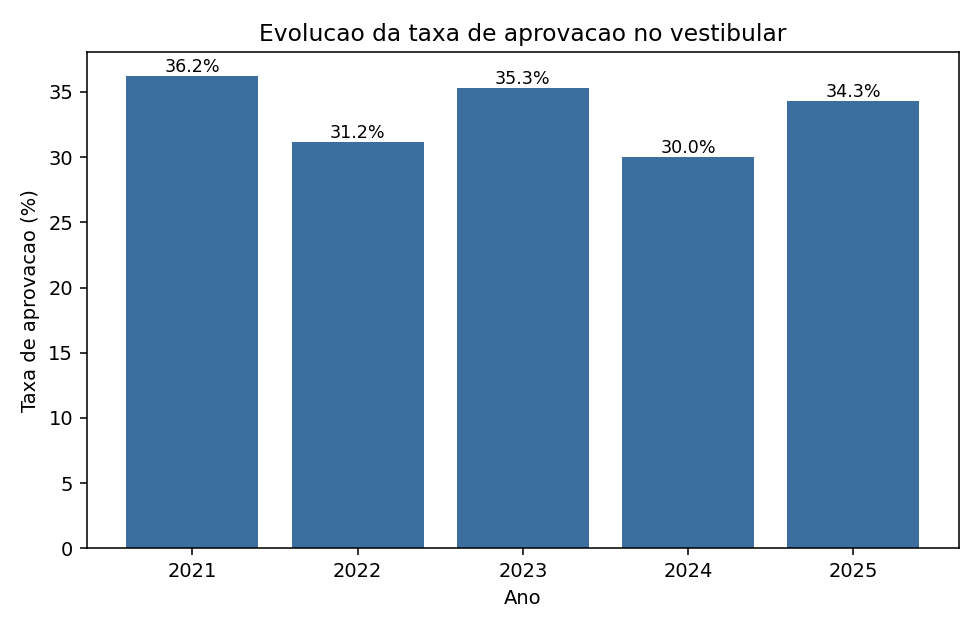
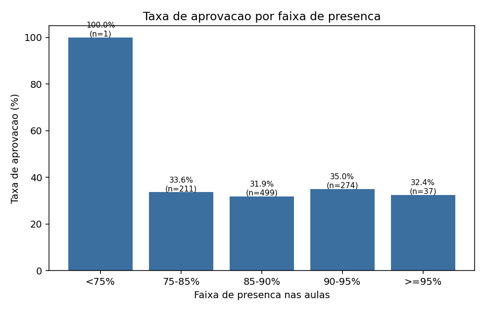
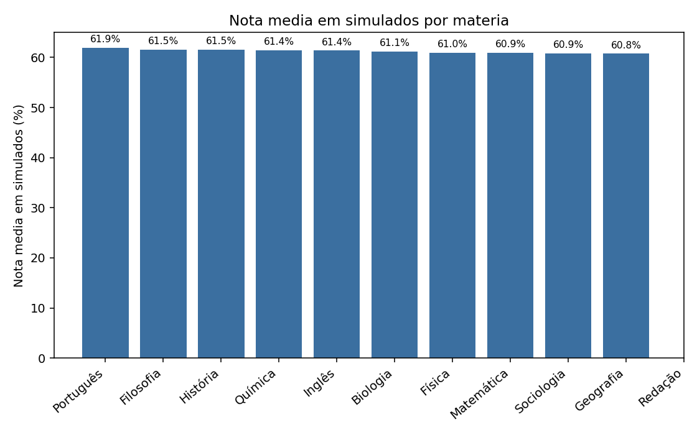
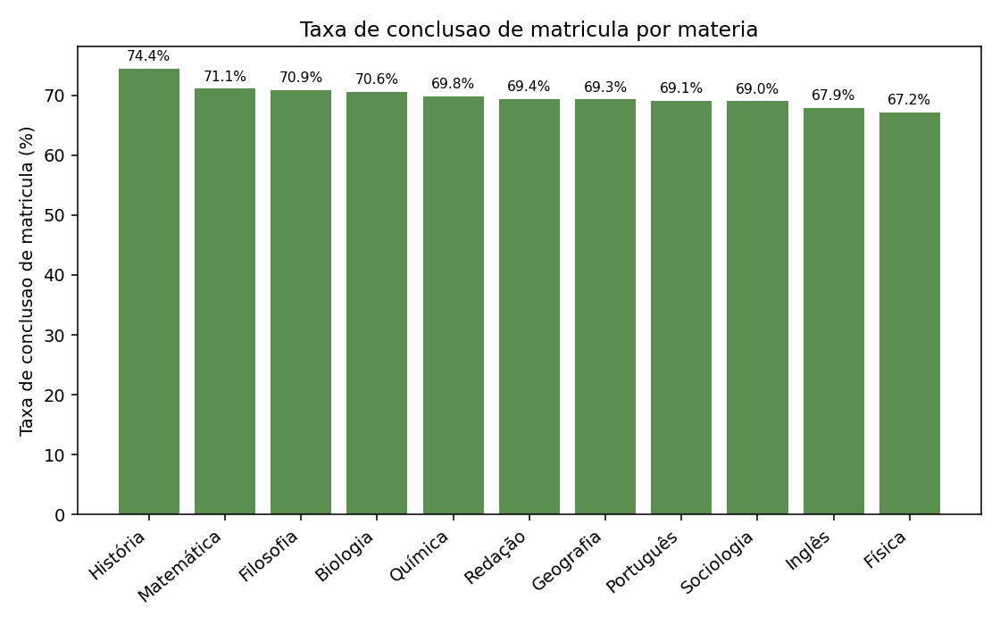

# Relatório Final — AprovaEdu Analytics

**Base analisada:** dados de 2021 a 2025 de uma rede de cursinhos pré-vestibulares (812 alunos, 34 professores, 220 ofertas de curso, ~9.500 matrículas, ~75.000 registros de presença, ~21.500 resultados de simulado e 354 aprovações no vestibular).

O processamento e o tratamento completo dos dados estão documentados em [`notebooks/01_etl_tratamento.ipynb`](../notebooks/01_etl_tratamento.ipynb) e [`src/etl.py`](../src/etl.py), com o significado de cada coluna descrito em [`docs/dicionario_dados.md`](../docs/dicionario_dados.md). As análises abaixo estão reproduzidas com código em [`notebooks/02_analise.ipynb`](../notebooks/02_analise.ipynb), e uma tentativa inicial de modelo preditivo está em [`notebooks/03_modelo_preditivo.ipynb`](../notebooks/03_modelo_preditivo.ipynb).

> **Nota metodológica (limitação):** nas perguntas 1 e 2, a aprovação de um aluno em determinado ano (`ano_vestibular`) é comparada com sua matrícula/presença no mesmo ano-calendário. Isso é uma aproximação: um aluno pode se matricular em um ano e prestar (ser aprovado no) vestibular em um ano posterior, ou estar cursando um ano diferente do cursinho no momento em que presta a prova. A base não tem uma coluna explícita que ligue "ano de preparação" a "ano do vestibular prestado", então optamos pela comparação direta por ano-calendário, que é a leitura mais simples e defensável com os dados disponíveis — mas ela pode diluir o efeito real de presença/matrícula sobre aprovação, já que parte do "match" aluno-ano está incorreto. Essa é a limitação mais importante a ter em mente ao interpretar as perguntas 1 e 2.

## Resumo executivo

- **Taxa de aprovação estagnada**: oscila entre 30% e 36% nos últimos 5 anos, sem melhora, mesmo com o número de matrículas quase dobrando (138 → 233 alunos/ano).
- **Presença nas aulas não explica aprovação** nesta base (correlação ≈ 0). Testamos até um modelo preditivo com presença, notas, bolsa e perfil do aluno — ele não consegue prever aprovação melhor que o acaso (AUC ≈ 0,49). Isso é um achado real, não uma limitação da análise.
- **O maior efeito encontrado não é acadêmico, é de captação**: alunos vindos por Indicação aprovam 12,3 pontos percentuais mais que os vindos por WhatsApp — a alavanca mais concreta para a coordenação agir agora.
- **Ação recomendada nº 1**: revisar a estratégia de captação por canal (ver Recomendação 1) — impacto potencial maior e mais rápido de medir do que qualquer ajuste pedagógico testado nesta análise.

---

## 1. Qual foi a evolução da taxa de aprovação ao longo dos anos?

**Métrica:** alunos aprovados no vestibular no ano / alunos com pelo menos uma matrícula naquele ano.

| Ano | Alunos matriculados | Alunos aprovados | Taxa de aprovação |
|---|---:|---:|---:|
| 2021 | 138 | 50 | 36,2% |
| 2022 | 170 | 53 | 31,2% |
| 2023 | 218 | 77 | 35,3% |
| 2024 | 263 | 79 | 30,0% |
| 2025 | 233 | 80 | 34,3% |

**Conclusão:** a taxa de aprovação oscila entre 30% e 36%, sem tendência de crescimento ou queda ao longo dos 5 anos — 2025 (34,3%) está praticamente no mesmo patamar de 2021 (36,2%). Apesar de o número de alunos matriculados quase ter dobrado no período (138 → 233), a proporção de aprovados não acompanhou esse crescimento, o que sugere que a expansão da base de alunos não veio acompanhada de ganho proporcional de efetividade.

---

## 2. Existe relação entre presença nas aulas e aprovação no vestibular?

| Faixa de presença | Taxa de aprovação | Nº de aluno-ano |
|---|---:|---:|
| 75–85% | 33,6% | 211 |
| 85–90% | 31,9% | 499 |
| 90–95% | 35,0% | 274 |
| ≥95% | 32,4% | 37 |

Correlação (presença × aprovação): **-0,011** (praticamente nula).

**Conclusão:** não encontramos, nesta base, evidência de associação relevante entre frequência nas aulas e aprovação no vestibular. A taxa de aprovação permanece entre 32% e 35% em praticamente todas as faixas de presença. Isso acontece em parte porque a maioria dos alunos já tem frequência alta e homogênea (mediana de 88%, desvio padrão de apenas ~4 pontos percentuais) — há pouca variação para comparar. Também é sinal de que a aprovação depende de outros fatores (desempenho em simulados, base de conhecimento prévia, concorrência da vaga) não capturados só pela frequência.

---

## 3. Quais cursos ou matérias parecem apresentar melhor desempenho?

| Matéria | Nota média em simulados | Taxa de conclusão de matrícula |
|---|---:|---:|
| Português | 61,9 | 69,1% |
| Filosofia | 61,5 | 70,9% |
| História | 61,5 | 74,4% |
| Química | 61,4 | 69,8% |
| Inglês | 61,4 | 67,9% |
| Biologia | 61,1 | 70,6% |
| Física | 61,0 | 67,2% |
| Matemática | 60,9 | 71,1% |
| Sociologia | 60,9 | 69,0% |
| Geografia | 60,8 | 69,3% |
| Redação | — (sem simulados objetivos) | 69,4% |

**Conclusão:** as diferenças de desempenho entre matérias são pequenas (menos de 1,5 ponto na nota média, e ~7 pontos percentuais na taxa de conclusão) — nenhuma matéria se destaca isoladamente como muito melhor ou muito pior. Um achado mais claro veio ao cruzar por **modalidade de oferta**: a modalidade Online tem a menor taxa de conclusão de matrícula (69,1%) frente a Presencial (70,5%) e Híbrido (70,2%). A diferença é pequena, mas consistente. Também identificamos que a matéria **Redação não possui simulados com nota numérica objetiva** na base — provavelmente é avaliada por correção manual não capturada neste conjunto de dados, o que é uma lacuna a ser resolvida para permitir comparação justa entre matérias.

**Nota sobre ambiguidade — "cursos" também pode significar cursos universitários.** Interpretamos "cursos" acima como as ofertas do cursinho (matérias/turmas), a leitura mais direta para uso no dia a dia da coordenação. Existe uma segunda leitura válida: `curso_aprovado` (em `aprovacoes_vestibular`) guarda o curso universitário de destino do aluno aprovado. Como complemento:

| Curso universitário | Nº de aprovações | Nota final média |
|---|---:|---:|
| Ciência da Computação | 16 | 754,4 |
| Administração | 24 | 753,6 |
| Design | 25 | 741,5 |
| Fisioterapia | 24 | 740,8 |
| Odontologia | 28 | 730,5 |
| Psicologia | 22 | 729,0 |
| Medicina | 25 | 721,4 |
| Enfermagem | 30 | 721,3 |
| Jornalismo | 21 | 719,5 |
| Economia | 26 | 711,1 |
| Engenharia de Software | 29 | 713,0 |
| Direito | 28 | 707,1 |
| Arquitetura | 29 | 707,2 |
| Engenharia Civil | 27 | 701,7 |

As 354 aprovações se distribuem de forma relativamente equilibrada entre 14 cursos (16 a 30 cada). A nota final média varia mais aqui (701–754) do que entre as matérias do cursinho — mas isso provavelmente reflete a nota de corte de cada curso/universidade, não a qualidade da preparação do cursinho nessa área específica. Por isso tratamos como leitura complementar, não como resposta principal.

---

## Análises complementares (apoiam as recomendações)

Além das 4 perguntas obrigatórias, cruzamos três variáveis que ajudam a explicar a estagnação da taxa de aprovação:

| Canal de captação | Taxa de aprovação |
|---|---:|
| Indicação | 43,4% |
| Google | 40,5% |
| Não informado | 40,5% |
| Feira escolar | 39,0% |
| Instagram | 34,5% |
| WhatsApp | 31,1% |

| Faixa média de bolsa | Taxa de aprovação | Nº de alunos |
|---|---:|---:|
| 1–10% | 35,5% | 124 |
| 11–20% | 40,8% | 557 |
| 21–30% | 29,1% | 117 |

| Dificuldade do simulado | Nota média |
|---|---:|
| Fácil | 61,3% |
| Média | 61,1% |
| Difícil | 61,3% |

- **Canal de captação** tem o maior efeito encontrado em toda a análise: Indicação converte 12,3 pontos percentuais melhor que WhatsApp.
- **Faixa de bolsa**: alunos com bolsa 21–30% aprovam menos (29,1%) que os com 11–20% (40,8%) — padrão a investigar com cautela dado o n menor, mas relevante.
- **Dificuldade do simulado** não se traduz em nota diferente — sinal de que a classificação não está calibrada pedagogicamente.

---

## Modelo preditivo (diferencial)

Como diferencial, testamos se conseguimos **prever a aprovação de um aluno** a partir dos sinais disponíveis durante o ano de preparação: presença, nota de diagnóstico, nota média em simulados, bolsa, escola de origem, canal de captação e cidade. Treinamos uma regressão logística (ver [`notebooks/03_modelo_preditivo.ipynb`](../notebooks/03_modelo_preditivo.ipynb)).

**Resultado**: AUC-ROC de **0,49** em validação cruzada de 5 folds (desvio-padrão de apenas 0,017 — ou seja, o resultado é estável, não é ruído do split). Um AUC de 0,50 equivale a previsão aleatória.

**Leitura honesta**: o modelo não consegue prever aprovação melhor que o acaso com os dados disponíveis. Isso generaliza o achado da Pergunta 2 (correlação presença × aprovação ≈ 0): **os sinais operacionais capturados hoje pelo cursinho não explicam quem é aprovado**. Duas leituras práticas:

1. Se o objetivo é ter um modelo preditivo funcional, é preciso capturar sinais adicionais que hoje faltam na base — por exemplo, a **evolução da nota do aluno ao longo do tempo** (tendência, não só média) e simulados específicos no formato do vestibular-alvo, aplicados perto da data da prova.
2. Optamos por **não entregar um modelo com falso senso de precisão**. Forçar uma métrica de acurácia mais "bonita" sem validade real seria enganoso para a coordenação; o valor real aqui está em reportar, com evidência estatística, que a aprovação não é explicada pelos dados operacionais disponíveis — uma informação tão acionável quanto um modelo que funcionasse.

## 4. Recomendações para a coordenação

1. **Realocar parte do investimento de captação para o canal Indicação e revisar a estratégia via WhatsApp.** É o maior efeito encontrado em toda a análise (43,4% x 31,1% de aprovação, 12,3 p.p. de diferença). Próximo passo concreto: comparar custo de aquisição por canal com a taxa de aprovação resultante (não só matrícula) para decidir realocação de verba, e revisar o script/abordagem usado no WhatsApp.
2. **Revisar o critério de concessão de bolsas acima de 20%.** Alunos com bolsa 21–30% aprovam menos (29,1%) que os com 11–20% (40,8%). Recomenda-se cruzar esse grupo com indicadores socioeconômicos e oferecer suporte pedagógico complementar — não só desconto financeiro — a quem recebe bolsa mais alta.
3. **Recalibrar os critérios de dificuldade dos simulados junto aos professores.** Notas médias praticamente idênticas entre simulados "Fácil", "Média" e "Difícil" (todas ~61%) indicam que a classificação atual não reflete dificuldade real, o que compromete o uso do simulado como termômetro de preparo por nível.
4. **Não usar frequência isolada como indicador de risco de reprovação.** A correlação observada é praticamente nula; um sistema de alerta baseado só em presença deve gerar muitos falsos negativos. Recomenda-se compor um indicador com nota em simulados + tendência de evolução ao longo do curso.
5. **Padronizar a avaliação de Redação em formato estruturado** (nota numérica gravada em base própria), hoje ausente da base de simulados — importante porque Redação tem peso alto em muitos vestibulares e atualmente não pode ser comparada com as demais matérias.
6. **Investigar a modalidade Online**, que tem a menor taxa de conclusão de matrícula entre as três modalidades oferecidas (69,1% vs. 70,5% Presencial e 70,2% Híbrido) — possível oportunidade de melhorar suporte/engajamento do aluno remoto.
7. **Padronizar a captura de dados na origem** (formulários/planilhas). Uma parte relevante deste desafio foi tratar inconsistências de digitação (maiúsculas/minúsculas, acentuação, abreviações, formatos de data divergentes, notas de simulado fora da faixa 0–100). Isso indica ausência de validação nos sistemas de cadastro, o que aumenta o custo analítico e o risco de erros silenciosos passarem despercebidos.
8. **Antes de investir em um modelo preditivo de risco de reprovação, ampliar a captura de dados.** Testamos um modelo com os dados atuais e ele não teve poder preditivo (AUC≈0,49, ver seção "Modelo preditivo"). Recomenda-se capturar a evolução temporal do desempenho do aluno (não só médias) e simulados no formato do vestibular-alvo aplicados perto da data da prova antes de tentar um modelo de produção.

---

## Observações sobre qualidade e limitações dos dados

- 3.787 registros de `resultados_simulados` tinham nota fora da faixa 0–100 (ex.: valores negativos ou acima de 1000) — foram anulados e sinalizados (`nota_valida=False`) em vez de descartados, preservando o registro da tentativa.
- Havia um cadastro duplicado de professor (`P_DUP_001`, sem nenhuma referência em ofertas/aulas/simulados) — removido.
- ~1% dos registros de presença não tinham status informado — tratados como categoria própria (`"Não registrado"`) em vez de "Ausente", para não distorcer a taxa de frequência real.
- Datas apareciam em 4 formatos distintos (`YYYY-MM-DD`, `YYYY/MM/DD`, `DD/MM/YYYY`, `MM-DD-YYYY`), todos convertidos com um parser específico documentado no ETL.
